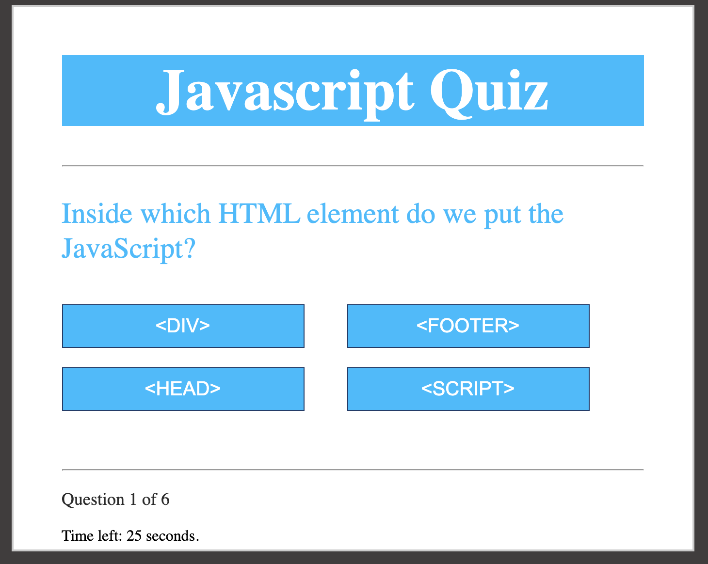

# 04 Web APIs: Code Quiz

Here is a coding quiz to demonstrate a multiple choice quiz. The programming allows for a shuffle of the answers so the quiz will change 
as it is run multiple times
The timer ticks down from 30 seconds and 10 seconds is lost for an incorrect answer. 
You may enter your initials at the end for a final score. 

[Live Site](https://jordanrbunnell.github.io/javascriptquiz/).

## Screenshot

